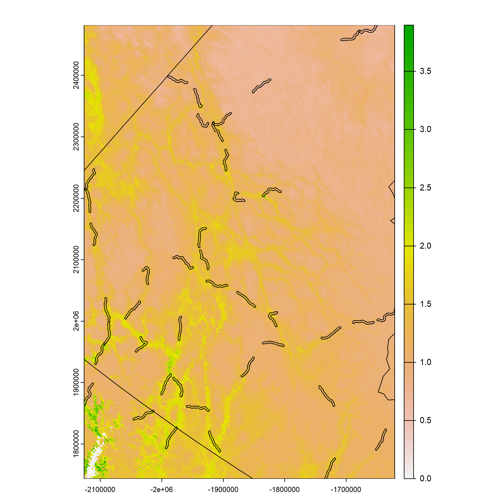
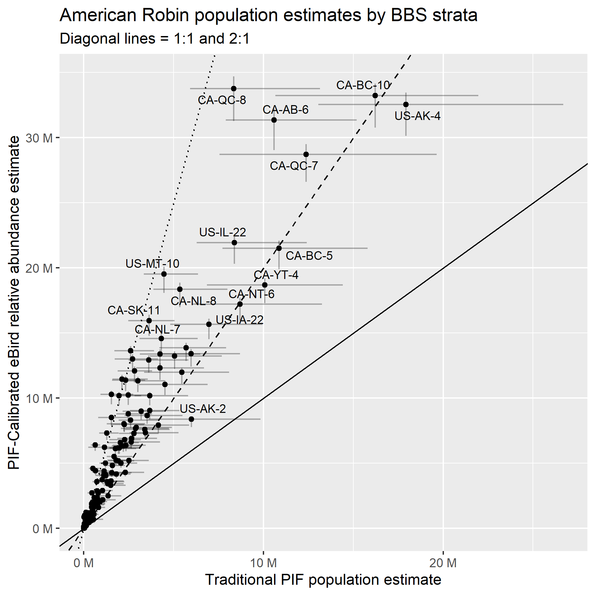
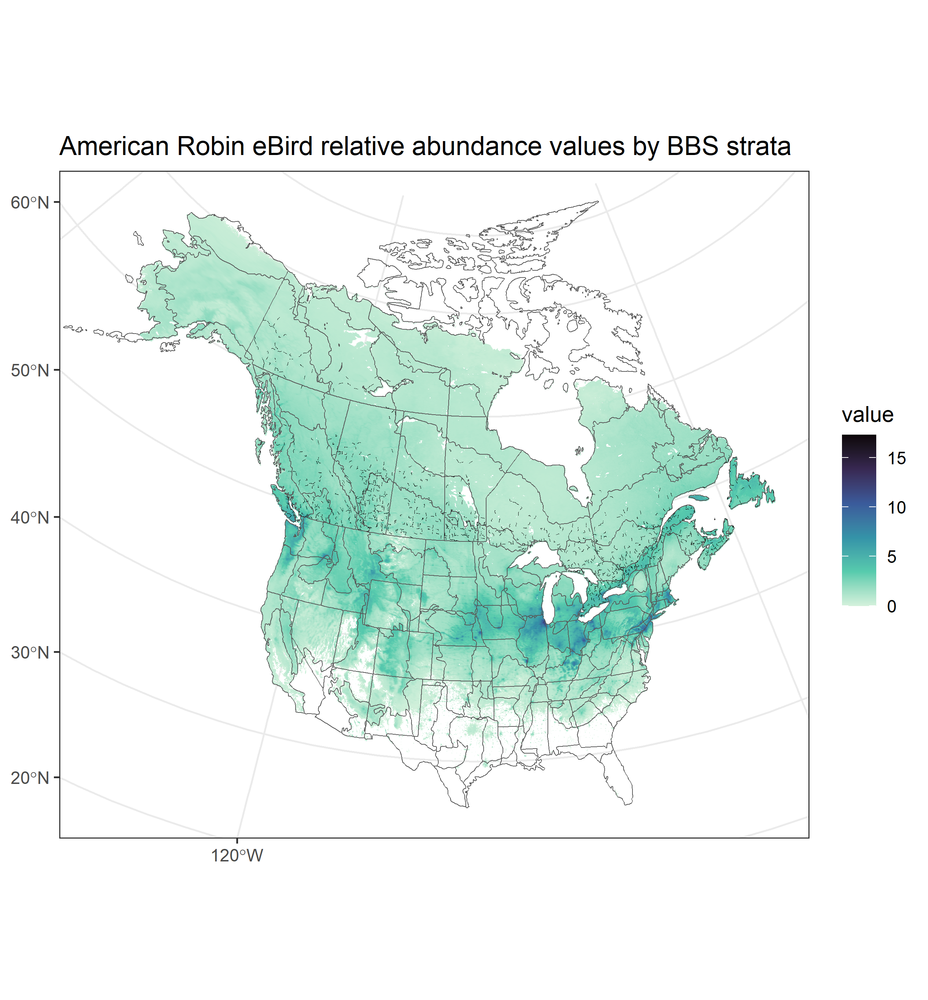

## Strata-free estimates

Instead of summarising BBS observations within broad scale geo-political strata (e.g., Bird Conservation Regions by political jurisdictions), we can summarise for only the areas surrounding each BBS route.

In effect, the PIF population estimates correction factors for time of day and pairs, as well as updated estimates of detection distance, can be applied to the area immediately surrounding BBS routes. This change, means that the PIF population estimates algorithm can be applied without assuming that BBS routes are a representative sample of each stratum (i.e., the habitat, the land area, or the species' population)

Instead the population estimates algorithm can be applied to only the area immediately surrounding BBS routes that were actually surveyed. It is relatively trivial to assume that the BBS observations are a representative sample of the birds, habitats, and land area within a short buffer (e.g.,1 km radius) of the route paths.

## eBird relative abundance

The eBird breeding season relative abundances can be summed within these same route path buffers.

The relationship between the PIF population estimates and the eBird relative abundances within these route path buffers provides a clear relationship between an estimated population size and the eBird relative abundance values.

For example, across all routes with some (\> 0) eBird relative abundance, we can compare the ratio of the mean eBird relative abundance to the mean population estimate. This ratio could be used as a simple calibration factor to scale the eBird relative abundance surface to a total population estimate (and to estimates for any other region).

## The representative sampling assumptions of the regional approach to PIF Population Estimates

The PIF population estimates derive population sizes for a given region based on the correction factors for distance $C_d$, pairs $C_p$, time of day $C_t$, and the area of the region $a$. The fraction in the first term of this equation represents the mean across all $m$ routes, of the mean counts across the $n_j$ years that each route $j$ was surveyed.

$$
Population Size = \frac{\sum_{j=1}^{j=m} \sum_{i=1}^{i=n_j} Y_{i j} / n_j}{m} * \frac{a}{25.1} *\left(\frac{400}{C_D}\right)^2 * C_P * C_T
$$

The region specific aspects of this equation require an assumption that the densities of birds detectable to BBS observers are representative of the densities of birds in the region. This assumption can be separated into two components: 1) the density of birds near roads in a given habitat/landcover type is the same as density of birds away from roads in that same landcover type; and 2) the proportion of each habitat/landcover type near the roads are representative of the proportions in the region as a whole.

## Alternative that removes/reduces the influence of these assumptions

By integrating the spatial information on the paths followed by each BBS route with the relative abundance surface from eBird, we can use the PIF population estimates approach in a way that should adjust the estimates for both the non representative sampling of habitats by the BBS and roadside specific variations in the abundance of each species.

With this alternative approach, we would modify the PIF population estimates equation to estimate the population density (population/unit area) of birds within the area adjacent to the $M$ BBS routes used in the calculation and within the detection radius of a given species $C_d$. The $M$ routes would be BBS routes surveyed at least once during years used in the calculation (usually the most recent 10 years) and that overlap the eBird breeding season, or resident, relative abundance surface.

$$
PopulationDensity_{BBSAdjacent} = \frac{\sum_{j=1}^{j=M}\frac{\sum_{i=1}^{i=n_j}Y_{i j}} {n_j} * C_P * C_T}{M*50\pi*{C_D}^2} 
$$

To complement this BBS-adjacent population density, we can estimate a relative density of the eBird abundance within a buffer surrounding the BBS route paths, as the area-weighted mean (i.e., weighted by the area of the cell that is overlapped by the buffer) of the predicted relative abundance values of $c_j$ cells overlapped by the buffer of route $j$ of each of the $M$ BBS routes.

$$
RelativeDensity_{BBSAdjacent} = \frac{\sum_{j=1}^{j=M} \frac{\sum_{i=1}^{i=c_j}RelativeAbundance_{i}*a_i}{\sum_{i=1}^{i=c_j}a_{i}}}{M}
$$

The area weighted mean relative abundance cell value is largely necessary because the highest spatial resolution of the eBird relative abundance surfaces has grid cells 3 km in width. So, the resolution of the eBird predicted abundance surface is coarse relative to the width of each BBS route buffer (depending on the chosen buffer width).

The ratio of these two density measures represent an approximate calibration of the eBird relative abundance surface to an estimate of true abundance.

$$
Calibration = \frac{PopulationDensity_{BBS Adjacent}}{RelativeDensity_{BBSAdjacent}}
$$

Then the population estimate for the species within any arbitrarily defined region can be calculated as the sum of the eBird relative abundance values within that region, scaled by the Calibration factor.

$$
PopulationEstimate = Calibration * \sum RelAbund
$$

Generating this calibration within relatively small areas surrounding the BBS routes adjusts the population estimates for the non-representative sampling of habitats by the BBS, to the extent that the species' relative abundance varies across those habitats. It does not explicitly adjust for variations in species density in a given habitat near or further from a road, however some of the variation in density in relation to roads is included in the eBird relative abundance surface modeling because road density is one of the predictors. So, this approach may also correct for variations in density between roadside and offroad habitats, to the extent that a species' density varies based on distance to roads and the eBird relative abundance surface is able to reflect that road-specific variation in density.

## Uncertainty

The above comparison of means across all BBS routes ignores the variation in the calibration across routes and the uncertainty in the estimation of the species abundance on any given BBS routes.

To account for the uncertainty of this calibration, we can fit a Bayesian hierarchical model that estimates the calibration factor while accounting for: 1) the variation in the calibration factor among repeated counts on each route, 2) the variation in the calibration factor among routes; and 3) all of the remaining uncertainty components used in PIF uncertainty estimates [@stanton2019].

This proposed model would use the area weighted mean eBird relative abundance cell values in the buffer zone of route-j ($RelativeAbundance_j$, same as above) to model the observed BBS counts at that route over the 10 most recent years of BBS data.

$$
RelativeAbundance_{j} = \frac{\sum_{i=1}^{i=c_j}RelativeAbundance_{i}*a_i}{\sum_{i=1}^{i=c_j}a_{i}}
$$

The log transformed mean area-weighted relative abundance of all cells c overlapped by the buffer around route-j can be used as an offset in a log-link model that predicts each observed BBS count ($C_{j,t}$) on route-j, in year-t. Treating these $log(RelativeAbuncance_j)$ as an offset assumes a linear relationship between the eBird relative abundance surface and the observed BBS counts. This assumption is explicit in this model formation, but also implicit in any ratio-based calibration. We can treat the observed BBS counts in a similar way to many of the common status and trend models for hte BBS [@smith2024] as realizations of a negative binomial distribution with mean $\lambda_{i,j}$ and inverse dispersion parameter $\phi$.

$$
C_{i,j} \sim NegativeBinomial(\lambda_{i,j},\phi) 
$$

$$
log(\lambda_{i,j}) = \beta_{j} + log(RelativeAbundance_{i,j})
$$

In this model formulation, the intercept ($\beta_j$) represents a scaling factor between the observed BBS counts and the eBird relative abundance for route-j. We can use a hierarchical structure to model the variation in the scaling factor among routes ($\sigma$), while accounting for the repeated observations at each route $\beta_j\sim Normal(\mu,\sigma)$. The hyperparameter $\mu$ estimates the mean eBird-BBS scaling factor across all routes, and its posterior distribution estimates the variation in that scaling.

We can then combine the posterior draws of the exponentiated scaling factor $\mu$, (including a retransformation factor, $0.5*\sigma^2$ to account for the asymetries of a log normal distribution) with the bootstrapping processes used in @stanton2019 to propagate the uncertainty of the scaling factor with the uncertainty of the correction factors for distance ($C_d$, a uniform distribution from 80% of the species' assigned distance category $$in km$$ to 10% above the distance category), time of day ($C_t$, normal distribution with mean and standard deviation estimated in @stanton2019), and pairs ($C_p$, truncated normal distribution with a mean equal to the species' assigned pair correction value, standard deviation equal to 0.13, and truncated at 1.0 and 2.0).

$$
Calibration = \frac{exp(\mu + 0.5*\sigma^2)*C_t*C_p}{50*\pi*C_d}
$$

This calibration factor mutliplied by an eBird relative abundance value in a given cell, represents an estimated number of birds per $km^2$.

For each posterior draw of the calibration factor, we can multiply the collection of eBird relative abundance cell values within any given area, account for the area of each cell (e.g., for the 3km cells in the highest resolution seasonal abundance surfaces 9 $km^2$), and generate a posterior draw of the species total population within that given area. Across all posterior draws, we can estimate the uncertainty of the population size estimate.

## Example: American Robin

This species eBird breeding season relative abundance surface suggests that BBS routes sample a relatively biased component of the species' distribution, at least in Northern Canada (Figure 1).

{fig.alt="Map of the BBS route buffers over the American Robin relative abundance surface. The route buffers overlap the regions of the map with the highest predicted abundance."}

The biased sampling of American Robin abundance by BBS routes in Yukon territory (almost entirely within BCR 4) suggests that the standard PIF population estimate for American Robins in Yukon will be biased high.

As expected, the relative population sizes across the species' range change when we estimate PIF population sizes using the calibration model described above, and we re-scale the estimates using distance corrections based on data-informed estimates from the NA-POPS project (i.e., estimates of effective detection radii and the availability of birds during 3 minute surveys at the mean survey time for BBS, see: ([Edwards et al. 2023](https://doi.org/10.1111/ibi.13169)). For example, all estimates increase with the new methods, except for many of the large northern strata such as CA-YT-4 and other regions where sampling is likely biased in a similar to to Yukon (US-AK-4, CA-QC-7, CA-NT-6). The same is true for some of the relatively large and mountainous strata (CA-BC-10 and CA-BC-5) where there are again likely similar biases in the BBS sampling (confined to valleys where there are roads and likely higher American Robin abundance than at higher elevations).

The map in Figure 3 shows the full breeding season relative abundance surface for American Robin and the location of the route paths used in the fitting of this model (i.e., the red squiggles).

